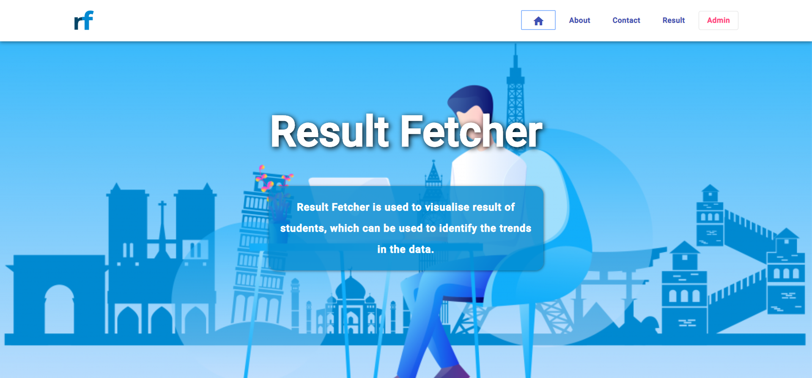

 Result Fetcher

**A Captcha decryption and automation tool to download result of students and visualize it.**

Result Fetcher Website is a web interface, which provides a means to view and visualise semester result of students, that can be used to identify the trends in the data.

It uses uses a custom trained model for decrypting captcha images of the following kind:

    

It also provides additional functionalities like filtering and sorting the data and currently allows the users to download the result in two formats i.e. CSV & PDF

    
     
    
     
    
     
    

## :earth_asia: Development Env Tools
* Windows 10
* Tensorflow
* Selenium
* Django